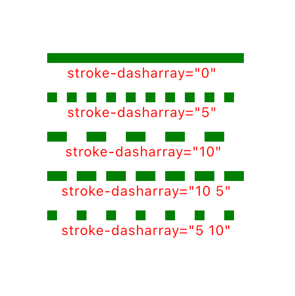
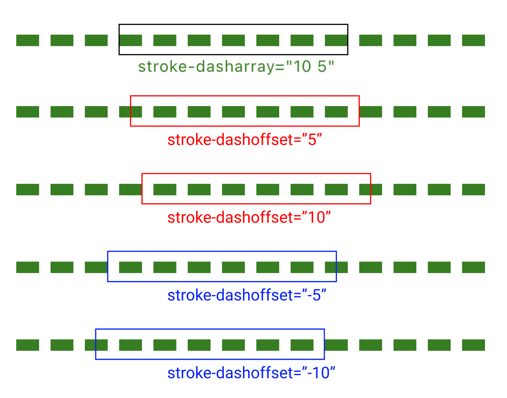
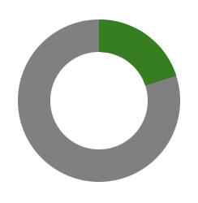
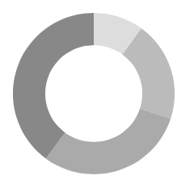

# SVG를 이용해 도넛 차트 만들기

## 왜 SVG?

`canvas`는 비트맵 영역을 활용하여 픽셀을 이용하기 때문에 해상도를 고려해야한다.

`<div>`를 이용하기엔 그러라고 있는 애가 아니다. 좀 더 맞는 애를 쓰자.

`svg`가 벡터 방식으로 반응형에도 알맞고 `<circle>` 태그의 `stroke`를 통해 원을 표현하기도 좋은 듯 하다.

## circle - stroke

도넛 모양을 표현하기 위해 원의 테두리를 이용한다.

[svg의 속성](https://developer.mozilla.org/en-US/docs/Web/SVG/Attribute#core_attributes)을 보면 테두리와 관련된 `stroke~` 류의 속성들이 있다.  
여기서 중요한 것들은 테두리를 점선으로 이용하기 위해 사용하는 `stroke-dasharray`와 `storke-dashoffset`!

### stroke-dasharray

`stroke-dasharray="a b"`를 통해서 점선인 테두리의 간격을 표현  
a는 테두리가 색칠될 부분이고 b는 점선 사이의 공백

  
출처 = Tecoble-리액트에서 도넛 차트를 만들어보자!

### stroke-dashoffset

`stroke-dashoffset="n"`을 통해서 점선의 시작 부분을 표현  
n이 양수이면 첫 시작을 n만큼 오른쪽으로 이동, 음수이면 왼쪽으로 이동해 아래 사진과 같이 변형

  
출처 = Tecoble-리액트에서 도넛 차트를 만들어보자!

### 주의할 점

`circle`에서 `stroke`를 사용하면 시작점은 3시 방향이다!

`dash`와 애니메이션을 이용할 때 주의할 것

## 그리기

```tsx
//...
const radius = (size - strokeWidth) / 2;
const circumference = 2 * Math.PI * radius;

return (
  <svg
    style={{ transform: 'rotate(-90deg)' }}
    width={size}
    height={size}
    viewBox={`0 0 ${size} ${size}`}
  >
    <circle
      cx={size / 2}
      cy={size / 2}
      r={radius}
      fill="none"
      stroke="gray"
      strokeWidth={strokeWidth}
    />
    <circle
      cx={size / 2}
      cy={size / 2}
      r={radius}
      fill="none"
      stroke="green"
      strokeWidth={strokeWidth}
      strokeDasharray={`${circumference * rate} ${circumference * (1 - rate)}`}
    />
  </svg>
);
```



`stroke-dasharray`의 끝 지점을 알기 위해서 원 테두리의 길이를 알아야할 필요가 있다.

원의 둘레는 대략 `2πr`로 도넛 차트를 완성 시키기 위해서 해당 둘레에 필요한 비율을 `stroke-dasharray` 값에 이용한다

또한 3시 방향에서 시작하는 차트를 12시 방향에서 시작해주기 위해 `transform`을 통해 -90도를 돌려놓았다.

## 여러 데이터를 한 번에 표시하기

지금까지는 한가지의 데이터를 표시했지만, 무릇 차트란 여러 데이터를 한 번에 표시해줘야한다.

여러 색상을 통해서 데이터를 구분해줘야하기 때문에 여러개의 `<circle>`태그를 이용해야한다.  
이제 필요한 것이 `stroke-dashoffset`이다.

첫번째 데이터가 끝난 뒤에 두번째 데이터를 첫번째 데이터가 끝난 자리부터 시작해줘야한다.  
즉, 앞선 데이터들의 누적합이 필요해진다.

```tsx
import React, { useMemo } from 'react';
import styled from '@emotion/styled';

export interface DonutChartProps {
  size: number;
  strokeWidth: number;
  dataset: {
    color: string;
    value: number;
  }[];
}

export default function DonutChart({
  size = 100,
  strokeWidth = 20,
  dataset = [],
}: DonutChartProps): JSX.Element {
  const radius = useMemo<number>(
    () => (size - strokeWidth) / 2,
    [size, strokeWidth],
  );
  const circumference = useMemo<number>(() => 2 * radius * Math.PI, [radius]);
  const total = useMemo<number>(
    () => dataset.map(({ value }) => value).reduce((prev, v) => prev + v),
    [dataset],
  );
  const ratios = useMemo<number[]>(
    () => dataset.map(({ value }) => value / total),
    [dataset, total],
  );
  const accArr = useMemo<number[]>(
    () =>
      ratios.reduce(
        (arr, v, i) => {
          const last = arr[arr.length - 1];
          return [...arr, last + v];
        },
        [0],
      ),
    [ratios],
  );

  return (
    <Container width={size} height={size} viewBox={`0 0 ${size} ${size}`}>
      {dataset.map(({ color }, i) => (
        <circle
          cx={size / 2}
          cy={size / 2}
          r={radius}
          fill="transparent"
          stroke={color}
          strokeWidth={strokeWidth}
          strokeDasharray={`${circumference * ratios[i]} ${
            circumference * (1 - ratios[i])
          }`}
          strokeDashoffset={circumference * (1 - accArr[i])}
        />
      ))}
    </Container>
  );
}

const Container = styled.svg`
  transform: rotate(-90deg);
`;
```



이를 위해 전체 값인 `total`과 그에 따른 각 데이터의 비율 `ratios`, 누적합 배열 `accArr`을 계산했다.

`total` 값을 계산해 비율을 구하기 때문에 기존에 남는 부분을 담당하던 `circle`은 사라졌다.

---

[리액트로 도넛 차트를 만들어보자!](https://tecoble.techcourse.co.kr/post/2021-11-10-making-donut-chart-react/)
[SVG와 삼각 함수로 도넛 차트 만들어보기](https://evan-moon.github.io/2020/12/12/draw-arc-with-svg-clippath/)
